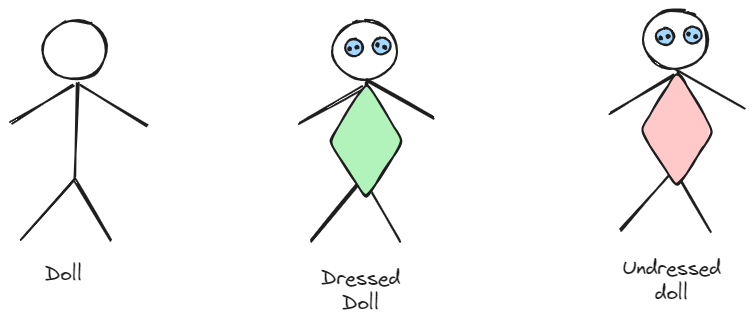
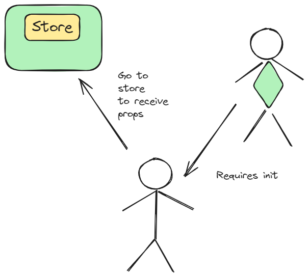
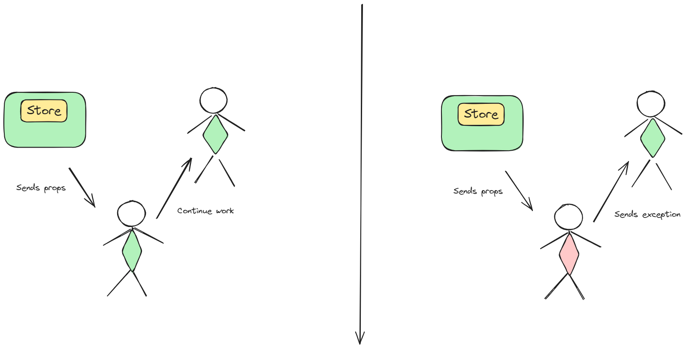

Dependency chain:
- hierarchical 
- using hooks

Well studied problem in html. Hierarchy can result in props drilling https://www.geeksforgeeks.org/what-is-prop-drilling-and-how-to-avoid-it.

Hook is basically tuple of value and function that can set it.
For your convenience you can modify that function according to desired behavior.

See https://legacy.reactjs.org/docs/hooks-intro.

Common analogy

Store

Store results

