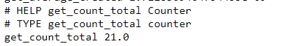

Metircs are exposed at `http://127.0.0.1:5020/metrics`

Find `get_count_total`, then check that metrics have static place in file

Has HELP and TYPE fields and increment when you go to `http://127.0.0.1:5020/counter`
